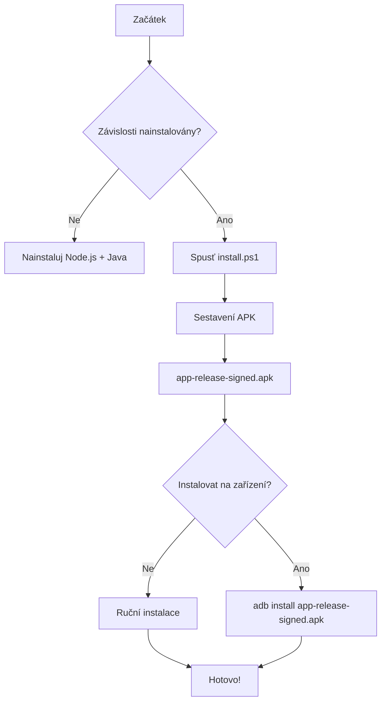

# Návod: Vytvoření instalačního APK souboru

Tento návod vás provede procesem sestavení **Android APK** z aplikace Společné Nálezy pomocí **Bubblewrap CLI** (Trusted Web Activity).

---

## 📋 Požadavky

### 1. Nainstalujte závislosti

| Nástroj | Verze | Stažení |
|---------|-------|---------|
| **Node.js** | 18+ | [https://nodejs.org/](https://nodejs.org/) |
| **Java JDK** | 11+ | [https://adoptium.net/](https://adoptium.net/) |
| **Android Platform Tools (ADB)** | - | Součást Android Studio |

**Verifikace instalace:**
```bash
node --version    # Mělo by vypsat verzi (např. v20.x.x)
npm --version     # Mělo by vypsat verzi (např. 10.x.x)
java --version    # Mělo by vypsat verzi JDK
adb --version     # Mělo by vypsat verzi ADB (volitelné)
```

---

## 🚀 Metoda 1: Jednokrokové sestavení pomocí PowerShell (Doporučeno pro Windows)

### 1. Spusťte PowerShell skript
Otevřete **PowerShell** (jako správce) v kořenovém adresáři projektu a spusťte:

```powershell
cd C:\Users\Administrator\Develop\appkanase
.\install.ps1
```

Skript **automaticky**:
- ✅ Zkontroluje všechny závislosti
- ✅ Nainstaluje Bubblewrap CLI
- ✅ Inicializuje Android projekt
- ✅ Sestaví podepsaný APK
- ✅ Nainstaluje na připojené zařízení (pokud je ADB dostupné)

**Volby:**
```powershell
.\install.ps1 -BuildOnly      # Pouze sestavit APK (bez instalace)
.\install.ps1 -InstallOnly    # Pouze nainstalovat existující APK
.\install.ps1 -SkipChecks     # Vynechat kontrolu závislostí
.\install.ps1 -Help          # Nápověda
```

---

## 🚀 Metoda 2: Jednokrokové sestavení pomocí CMD

### 1. Spusťte batch soubor
Dvojklikem spusťte nebo z příkazového řádku:

```batch
cd C:\Users\Administrator\Develop\appkanase
install.bat
```

Skript provede stejné kroky jako PowerShell verze.

---

## 🚀 Metoda 3: Ruční sestavení (Univerzální)

### 1. Nainstalujte Bubblewrap CLI
```bash
npm install -g @bubblewrap/cli
```

### 2. Verifikujte instalaci
```bash
bubblewrap --version
```

### 3. Inicializujte Bubblewrap projekt
Použijte místní `twa-manifest.json` (již součástí projektu):
```bash
cd C:\Users\Administrator\Develop\appkanase
bubblewrap init --manifest=./twa-manifest.json
```

**NEBO** použijte vzdálený manifest:
```bash
bubblewrap init --manifest=https://ais-dev-ochb7phnvq4bdvo3ldq4zb-291037164760.europe-west3.run.app/manifest.json
```

### 4. Sestavte APK
```bash
bubblewrap build
```

---

## 📁 Výstup

Po úspěšném sestavení bude vytvořen soubor:
```
app-release-signed.apk
```

**Umístění:** `C:\Users\Administrator\Develop\appkanase\app-release-signed.apk`

---

## 📱 Instalace APK na zařízení

### Možnost A: Pomocí ADB (doporučeno)
1. Připojte Android zařízení prostřednictvím USB
2. Povolte **USB Debugging** v Nastavení → Vývojářské možnosti
3. Spusťte:
```bash
adb devices          # Zkontrolujte připojené zařízení
adb install app-release-signed.apk
```

### Možnost B: Ruční instalace (Sideloading)
1. Přeneste `app-release-signed.apk` do mobilu (např. přes USB, email, cloud)
2. V mobilu povolte **Neznámé zdroje** (Nastavení → Zabezpečení)
3. Otevřete soubor `app-release-signed.apk` a nainstalujte

---

## ⚙️ Konfigurace APK

Soubor `twa-manifest.json` obsahuje konfiguraci APK:

```json
{
  "packageId": "cz.spolecnenalezy.app",
  "name": "Společné Nálezy",
  "launcherName": "Nálezy",
  "host": "ais-dev-ochb7phnvq4bdvo3ldq4zb-291037164760.europe-west3.run.app",
  "signingKey": {
    "path": "./android.keystore",
    "alias": "android"
  }
}
```

### Úprava aplikace
- **Název aplikace**: Změňte `name` a `launcherName`
- **Balíček (Package ID)**: Změňte `packageId` (musí být unikátní)
- **Cílový server**: Změňte `host` na svou doménu
- **Barvy**: Upravte `themeColor`, `navigationColor`, `backgroundColor`

---

## 🔧 Řešení problémů

### Chyba: `bubblewrap: command not found`
**Řešení:** Nainstalujte Bubblewrap globálně:
```bash
npm install -g @bubblewrap/cli
```

### Chyba: `Java not found`
**Řešení:** Nainstalujte Java JDK z [https://adoptium.net/](https://adoptium.net/)

### Chyba: `No devices found`
**Řešení:**
- Připojte zařízení prostřednictvím USB
- Povolte USB Debugging v Nastavení → Vývojářské možnosti
- Nainstalujte ovladače pro své zařízení

### Chyba: `Failed to sign APK`
**Řešení:** Zkontrolujte, zda existuje `android.keystore` v kořenovém adresáři projektu. Pokud ne, vytvořte nový:
```bash
keytool -genkey -v -keystore android.keystore -alias android -keyalg RSA -keysize 2048 -validity 10000
```
Heslo: `android` (nebo změňte v `twa-manifest.json`)

### Chyba: `Failed to fetch manifest`
**Řešení:** Použijte místní `twa-manifest.json`:
```bash
bubblewrap init --manifest=./twa-manifest.json
```

---

## 📊 Souhrn kroků



---

## 🎯 Příklady použití

### Příklad 1: Rychlé sestavení
```powershell
cd C:\Users\Administrator\Develop\appkanase
.\install.ps1
```

### Příklad 2: Pouze sestavení (bez instalace)
```powershell
.\install.ps1 -BuildOnly
```

### Příklad 3: Pouze instalace existujícího APK
```powershell
.\install.ps1 -InstallOnly
```

### Příklad 4: Ruční proces
```bash
npm install -g @bubblewrap/cli
bubblewrap init --manifest=./twa-manifest.json
bubblewrap build
adb install app-release-signed.apk
```

---

## 📚 Dodatečné zdroje

- [Bubblewrap CLI Dokumentace](https://github.com/GoogleChromeLabs/bubblewrap)
- [Trusted Web Activity (TWA)](https://developer.chrome.com/docs/android/trusted-web-activity/)
- [Android App Bundles](https://developer.android.com/guide/app-bundle)

---

## ✅ Dokončeno!

Po úspěšném sestavení budete mít **`app-release-signed.apk`** – plně funkční Android aplikaci, kterou lze:
- Instalovat na jakékoliv Android zařízení
- Distribuovat prostřednictvím Google Play (po dalších úpravách)
- Používat pro testování a vývoj

**Aplikace podporuje:**
- PWA funkcionalitu (offline, push notifikace)
- GPS lokalizaci
- Fotoaparát
- Gemini AI API
- Kompletní synchronizaci s backendem
